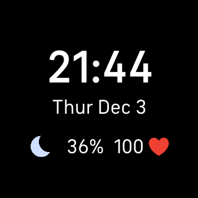
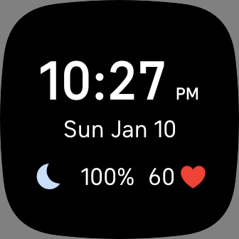

# ⌚ Fitibt Minimal Clock Face

A clock face compatible with Fitbit Sense and Versa 3 that shows a couple of info. It was made by eye so don't mind the position of the UI elements and some weather icons on the clock  

You can install it [here](https://gallery.fitbit.com/details/9c63e95d-d584-48cb-b315-f83e0737aa2a)  
Or here [https://gallery.fitbit.com/details/9c63e95d-d584-48cb-b315-f83e0737aa2a](https://gallery.fitbit.com/details/9c63e95d-d584-48cb-b315-f83e0737aa2a)

## TODO:
- [ ] AOD
- [ ] Finish localization (like all languages)
- [x] Add suport for a 12h hour watches ✅
- [ ] Better error handling
- [ ] ~~Lat Lng in settings~~ Add support for geo-location
- [ ] Validate inputs on setttings page (https://dev.fitbit.com/build/reference/settings-api/#components)
- [ ] ~~change weather to city country~~
- [ ] check if old value is equal to new value on change event
## BUGS:
- ~~Invalid longitude and latitude values~~

## Resources

### Weather Icons
The weather icons come from this [page](https://www.deviantart.com/ncrystal/art/Google-Now-Weather-Icons-597652261) 

### Weather data
It's provided by the Open Weather Map API
 
